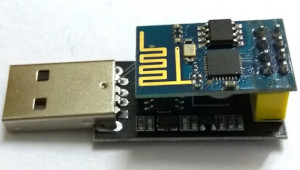

(Micro)Python connector to ESP8266 ESP-01(S) using AT-Commands via serial UART.

## (Micro)Python ESP8266 ESP-01 AT-driver

This project implements the most important AT commands to drive an ESP8266 ESP-01(S) in python or micropython.

The wireless chip is known for its energy efficient data transmission compared to USB-integrated wifi adapters used by
an operating system. The communication with the chip uses AT commands via a serial line interface (UART). It is
therefore not suitable as a general wifi adapter but very useful in low-energy scenarios like microcontrollers for IoT.



#### Example use-case

A non-wifi raspberry pi (version 1+2) or rpi zero (v1.2 + v1.3) which run on battery or low power can use the python
implementation to connect a custom python application to a wireless network. For raspberry pico, an implementation in
[micropython](https://micropython.org/) is available in the
[_micropython_](https://github.com/RalfHerzog/ESP8266-ESP01-python/tree/micropython) branch.

### Features

* [X] Join wireless networks
* [X] Disconnect from wireless network
* [X] TCP-Client
* [X] TCP-Server
* [X] Sample raw TCP server
* [X] Sample raw TCP client
* [X] Sample HTTP server (builds on top of TCP server)
* [X] Sample HTTP client (builds on top of TCP client)

### Sample code

---
HTTP-Client on raspberry pi / PC using an usb-adapter receiving own external ip address

```python
from esp8266.esp8266_01 import Esp8266, Type, WifiMode

esp = Esp8266.usb()

# Join your network
esp.mode(WifiMode.CLIENT)
esp.join('SSID', 'MySecureWifiPassword')

# Test connection
if esp.attention():
    # Try to connect to remote server
    if esp.connect(t=Type.TCP, address='api.ipify.org', port=80):
        # Send query
        query = f'GET / HTTP/1.0\r\nHost: api.ipify.org\r\n\r\n'
        if esp.send(query):
            # Show response on console
            data = esp.receive()['data']
            if data is not None:
                print(data.decode('ASCII'))
        # Close connection if not already done by the server
        esp.ip_close()
```

Output from raspberry pi / PC using an usb-adapter

```text
WARNING:Esp8266:Timeout waiting for reply
INFO:Esp8266:=> AT
DEBUG:Esp8266:<= OK
DEBUG:Esp8266:Response validation returned [True]
INFO:Esp8266:=> AT+CWMODE=1
DEBUG:Esp8266:<= OK
DEBUG:Esp8266:Response validation returned [True]
INFO:Esp8266:=> AT+CWJAP="SSID","MySecureWifiPassword"
DEBUG:Esp8266:<= WIFI DISCONNECT
DEBUG:Esp8266:<= WIFI CONNECTED
DEBUG:Esp8266:<= WIFI GOT IP
DEBUG:Esp8266:<= OK
DEBUG:Esp8266:Response validation returned [True]
INFO:Esp8266:=> AT+CIPSTART="TCP","api.ipify.org",80
DEBUG:Esp8266:<= CONNECT
DEBUG:Esp8266:<= OK
DEBUG:Esp8266:Response validation returned [True]
INFO:Esp8266:=> AT+CIPSEND=39
DEBUG:Esp8266:<= OK
DEBUG:Esp8266:Response validation returned [True]
INFO:Esp8266:=> Write 39 bytes ...
HTTP/1.1 200 OK
Server: Cowboy
Connection: close
Content-Type: text/plain
Vary: Origin
Date: Mon, 28 Feb 2022 21:42:07 GMT
Content-Length: 15
Via: 1.1 vegur

123.21.131.154
INFO:Esp8266:=> AT+CIPCLOSE
DEBUG:Esp8266:<= CLOSED
DEBUG:Esp8266:<= AT+CIPCLOSE
DEBUG:Esp8266:<= ERROR
DEBUG:Esp8266:Response validation returned [False]
```